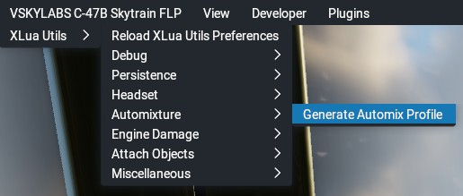
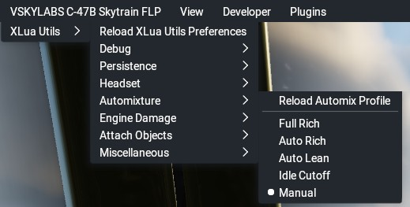

## Xlua Utils automixture utility

This document contains information about Xlua Utils' automixture utility.

[Back to Readme.md](../README.md) 

&nbsp;

<a name="toc"></a>
### Table of Contents
1. [Principles of Operation](#1)
2. [Disclaimers for the Object File Editor](#2)
3. [Known Issues](#3)  
4. [Menu](#3)  
5. [Profile File](#3)   

&nbsp; 

<a name="1"></a>
### 1. Principles of Operation

#### 1.1 Mixture manipulation

The  "Auto Rich" and "Auto Lean" modes basically adjust the mixture until a given target air-fuel-ratio (AFR) is obtained. Since X-Plane does not calculate said air-fuel-ratio by default, a custom calculation method based on a [MSc. Thesis by E. Fantenberg](http://liu.diva-portal.org/smash/get/diva2:1259188/FULLTEXT01.pdf) for air mass flow estimation in combustion engines had to be implemented.
To obtain the FAR for each of of the aircraft's engines, air mass flow is calculated from inlet pressure (MAP), displacement, RPM, the gas constant of air and air temperature and divided by fuel flow obtained from X-Plane.

With the current AFR continuously determined from fuel flow, X-Plane's mixture dataref (sim/cockpit2/engine/actuators/mixture_ratio) is adjusted within a given permissible value range (to avoid accidental engine cutoff) to attempt to match the current to the target AFR.
While this method is not the most accurate one as it is very simplified and has to work within a timer loop trying to minimize the required CPU cycles while providing an accurate result, it is efficient and was easy to code (see the "Automix_MainTimer()" function in _"util_automixture.lua"_).   

#### 1.2 Object file editing

While the core automixture logic may run "underneath the cowling" of any piston aircraft, users may also wish to replicate the visual and interactive mixture lever behavior of the actual aircraft. The problem with this is that the model files of the aircraft that requires this automixture utility have most likely not been set up for this. The mixture levers usually only work as standard levers without any detents of any kind.

To work around this, the automixture utility is equipped with an object file editing capability. Because X-Plane's object files are nothing but text files, they can be read, edited and saved with the appropriate Lua instructions. An aircraft reload will then instantly reflect the implemented changes. Object replacement is completely optional and the associated information is read from the automixture config file.

After the automatic editing of an object file, the aircraft must be reloaded from the "Developer" -> "Reload the Current Aircraft and Art" menu.

#### 1.3 Datarefs for custom mixture levers

The automixture utility supplies custom datarefs to control its mixture lever logic from the edited mixture lever objects or external hardware. These datarefs are:

- ```xlua/automixture/mixture_lever_anim```     
This is a float array type dataref with 8 indexes (representing the maximum number of engines on X-Plane aircraft), i.e. ```xlua/automixture/mixture_lever_anim[0]``` to ```xlua/automixture/mixture_lever_anim[7]```. 
- ```xlua/automixture/mixture_lever_anim_all```     
A float type dataref used for manipulating all mixture levers at once.
- ```xlua/automixture/toggle_manual_mode```   
An integer type dataref used to toggle between manual and detent lever mode.   
A value of "1" enables direct adjustment of the mixture levers while a value of "0" enables automixture control.

#### 1.4 Configuration

Automixture configuration is read from  _"xlua_utils/automixture_profile.cfg"_. This file is not initially present and has to be generated from the menu. It contains engine parameters and object replacement information. See farther below for file structure and syntax.

#### 1.5 Integration

The automixture core logic is only active when at least one engine of the current aircraft is of a reciprocating type.

To avoid interference with aircraft that do not need automixture, the mixture manipulation logic is only active when there is a profile file present.

**[TO DO: MANUAL MODE WITH DIRECT CONTROL OF  XP MIXTURE FROM CUSTOM LEVER DREFS]**

By default, the core logic of the automixture utility updates in 20 Hz intervals (i.e. every 0.05 seconds) to keep the performance impact in X-Plane as low as possible.


#### 1.6 Persistence

The update frequency for the timer as well as the mixture mode for each engine is stored in _"preferences.cfg"_ in the "xlua_utils" folder. The preferences file is updated when generating an automixture profile file (see below) and when unloading the aircraft while quitting X-Plane or an aircraft reload. It is read every time the automixture utility is initialized or reloaded.

The relevant lines in _"preferences.cfg"_ are:
- ```AUTOMIXTURE,MainTimerInterval:string,0.05:number```, with "0.05" representing the refresh rate of the core logic.
- ``` AUTOMIXTURE,MixtureMode:string,Manual:string,Manual:string,Manual:string,Manual:string,Manual:string,Manual:string,Manual:string,Manual:string``` stores the current mixture mode for each engine. Valid values are: "Manual", "IdleCutoff", "AutoLean", "AutoRich" and "FullRich".

**[TO DO: FIX NON-PERSISTENT MIXTURE MODES]**

&nbsp;

[Back to table of contents](#toc)

&nbsp;

<a name="2"></a>
### 2. Disclaimers for Object File Editing

- **Mind copyrights!**   
While it is generally okay to modify object files for personal use, distributing modified object files to others is subject to the license of the aircraft that the object file belongs to!   
In case of doubt, ask the original author for permission to distribute a modified file.   
Sharing _"automixture_profile.cfg"_ files is okay as these only provide instructions for the automated object file editing.

- **Backups**   
The first time an object file is edited, a backup of the original file is created (e.g. "myobject.obj" to "myobject.bak").   
Subsequent object editing operations will **only be performed with the backup file as source** to avoid completely messing up an object file.   
Regardless, it is strongly advised to create **a manual backup of any file you wish to edit**.   
In any case, each edit comes with...

- **No warranty!**     
If the replacement operation breaks the aircraft's object files, X-Plane, your computer, etc. I can not be held responsible.   
Make manual backups and use common sense when defining object file editing operations. Better to be safe than sorry!

&nbsp;

[Back to table of contents](#toc)

&nbsp;

<a name="3"></a>
### 3. Known Issues

- Object file editing has only been tested on Linux!

- **The object editing capability is as foolproof as I could make it, but it's best to make a manual backup of the original file(s).**

- Editing an object file of an aircraft that is equipped with an auto-updating plugin (e.g. STMA updater or Skunkcrafts Updater) will trigger an update, reverting the file(s) to its/their original state. It is thus advised to disable these plugins for the aircraft.

- After successful object editing, the aircraft must be reloaded manually.

- Due to the simplified nature of calculating AFR, the resulting mixture setting may not always deliver textbook power.

&nbsp;

[Back to table of contents](#toc)

&nbsp;

<a name="4"></a>
### 4. Menu

Without _"xlua_utils/automixture_profile.cfg"_ present, the only available menu item is "Generate Automix Profile". Upon clicking this menu item,  _"xlua_utils/automixture_profile.cfg"_ will be generated, parse and the menu will be updated.



&nbsp;

When _"xlua_utils/automixture_profile.cfg"_ is present, the complete range of menu items is available.



- "Reload Automix Profile" reads _"xlua_utils/automixture_profile.cfg" and the automixture related lines from _"preferences.cfg"._
If the file is not present anymore, the menu will reload into the "without profile" state.  
If the file has been found, the information within the profile file will be parsed. 
- "Full Rich" sets X-Plane mixture for all engines to 100 %.
-  "Auto Rich" continuously updates the X-Plane mixture for all engines to attain a (default) air-fuel-ratio of 12.5 to 1.
-  "Auto Lean" continuously updates the X-Plane mixture for all engines to attain a (default) air-fuel-ratio of 16.5 to 1.
-  "Idle Cutoff" sets X-Plane mixture for all engines to 0 %.
-  "Manual" is the default mode, allowing regular X-Plane mixture control from keys, input hardware or datarefs.

&nbsp;

[Back to table of contents](#toc)

&nbsp;

<a name="5"></a>
### 5. Profile File

The following section documents the structure of the _"automixture_profile.cfg"_ file. When generating _"automixture_profile.cfg"_ from the associated menu item, the file will contain comments, which can be used for quick reference while setting it up.   

Lines designated as comments (with a leading "#") will not be parsed.

Line items are separated with a comma ",".

Each line in the profile file must  define the category the line belongs to. Available categories are:
- "CONFIG": Line defines a value for an engine parameter
- "REPLACE": Line defines an object file replacement operation.

&nbsp;

#### 5.1 "CONFIG" lines

These are the available "config" type lines:
- ```CONFIG,Eng_Displace_Litres,29.98833```   
Engine displacement in litres, one value for all engines

- ```CONFIG,Eng_Volumetric_Efficiency,1```   
Volumetric efficiency of all engines (potentially deprecated)

- ```CONFIG,Lever_Detents,0.05,0.4,0.9,0.975```     
The detents of the mixture lever, as used by the datarefs supplied by the automixture utility. First value is "Idle Cutoff", second is "Auto Lean", third is "Auto Rich", fourth is "Full Rich". All value ranges are from 0 to 1.0.

- ```CONFIG,Lever_Detent_Magnet,0.05```     
The range above or below the detent setting at which the lever will "snap" into the detent.

- ```CONFIG,AirFuelRatio_Targets,12.5,16.25```     
The target air-fuel-ratio for the "Auto Lean" and "Auto Rich" mixture setting

&nbsp;

#### 5.1 "REPLACE" lines

The syntax for "REPLACE" type lines is the following:

```REPLACE,[path to file],[expression or line to be replaced],[replacement line or expression]```

- "[Path to file]" is the path to the object file **relative to the aircraft's root folder**.
- "[Expression or line to be replaced]" is the target line that is to be replaced.     
**No line numbers are needed, but make sure to put the entire line here, including whitespace to increase the chance of a successful replacement operation.**
- "[replacement line or expression]" is the line that replaces the target line.

&nbsp;

Here are some general rules and considerations for editing object files:

- Only text files (OBJ or else) are supported, not binary files (in case X-Plane ever implements a binary object file format).
- There is no limit on the amount of "REPLACE lines".
- Replacements work line by line. You can not define the content of two lines from the object file in a single "REPLACE" line.
- Square parenthesis ('[' and ']') must be prefixed with a percent character ("%"), e.g. 'engine_RPM%[2%]'.
- Minus signs must be prefixed with percent characters ("%"), e.g. 'ANIM_rotate_key %-85.000000'.

&nbsp;

#### 5.3 Examples

Example _"automixture_profile.cfg"_ files for some add-on aircraft can be found in _"xlua_utils/Config Files/Automixture"_. These may be used as a starting point or template. Contributions are welcome.

&nbsp;

[Back to table of contents](#toc)

&nbsp;