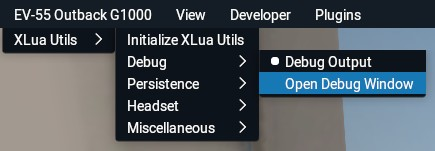
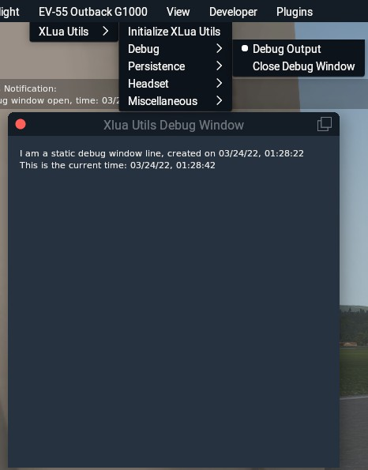

## XLuaUtils Developer Reference

This document contains information about some XLuaUtils features useful for XLua script developers.

[Back to Readme.md](../README.md) 

&nbsp;

### Table of Contents
1. [Limitations](#1)   
2. [Global Variables and Paths](#2)   
3. [Logging](#3)   
4. [Preferences](#4)   
5. [Menus](#5)   
6. [Notifications](#6)   
7. [Debug Window](#7)    
8. [Dataref Handlers](#8)   

&nbsp;

### 1 Limitations

- As XLua name spaces are completely local, reading variables from other scripts is not possible.   
If you want to use any of XLuaUtils' functions in airplane related scripts, add them as a sub-module at the end of the "sub-modules" section in `xluautils.lua`.
- Any XLua limitations apply, especially regarding table scope in XLua 1.1 or newer. Any table must be - and is being - treated as local.
- XLuaUtils' capabilities do not encompass the full extent of X-Plane's API (yet?).

&nbsp;

[Back to table of contents](#toc) 

&nbsp;

### 2 Global Variables and Paths

XLuaUtils will populate the following variables at script startup:

- `ACF_Folder`   
Complete path of the folder that the .acf file of the user aircraft is located in.
- `ACF_Filename`   
Name of the user aircraft's .acf file.
- `XLuaUtils_Path`   
Complete path of the XLuaUtils root folder.
- `XLuaUtils_PrefsFile`   
Complete path to the XLuaUtils preferences file, including filename.

These variables are available in all of XLuaUtils' sub-modules.

&nbsp;

[Back to table of contents](#toc) 

&nbsp;

### 3 Printing and Logging

#### 3.1 Printing

Printing to X-Plane's developer console (and stdout) is done with `PrintToConsole(inputstring)`, with _"inputstring"_ being the string that's to be printed.

#### 3.2 Logging

XLuaUtils possesses logging capabilities outside of X-Plane's _"Log.txt"_. By default, log output is written to _"xluautils/z_XLuaUtils_log.txt"_. This file is recreated at every plugin start of XLua. All log entries are timestamped.

Writing to XLuaUtils' log file is achieved by `WriteToLogFile(inputstring)`, with _"inputstring"_ being the string that's to be written to the log file.

Combined printing to the developer console and writing to the log file at the same time is done with `LogOutput(inputstring)`.

#### 3.3 Debug-Level Logging

Information that is not necessary for day-to-day usage can be printed to the developer console and logged in XLuaUtil's log file with `DebugLogOutput(inputstring)`. This will only output an input string if _"Debug Output"_ has been activated in the _"XLuaUtils/Debug"_ menu or the preferences file. 

 

&nbsp;

[Back to table of contents](#toc) 

&nbsp;

### 4 Preferences

XLuaUtils can store configuration data for itself and any utility implemented as a sub-module in a preferences file. This file is located in the _"XLuaUtils"_ folder by default and named _"preferences.cfg"_.   
Configuring a module to use the preferences handling system and interacting with a preferences file and table is explained below.

#### 4.1 Preferences Table Format

Preferences information for XLuaUtils or any of its sub-modules is stored in specifically structured Lua tables. Any sub-module wishing to use the preferences system must use a table configured as per the following example.   
Note that, as of XLua 1.1 (or higher), a preference table has to be defined as local and are constrained to the XLuaUtils sub-module in which they are declared.

	local MyConfigTable = {
	{"EXAMPLE"}, -- A unique identifier string indicating the owner of values stored in the preferences file.
	{"MyParameter",12}, -- A sub-table with a setting parameter. The first value of this table must always be a unique string identifying the parameter.
	{"MyOtherParameter",50,20,"Yes"}, -- Parameter sub-tables support numbers and strings, but no further sub-tables.
	}

#### 4.2 Reading/Writing From/To The Preferences File

Reading from the preferences file is done with `Preferences_Read(inputfile,outputtable)`, where _"inputfile"_ is the path to the target file (usually the `XLuaUtils_PrefsFile` variable) and _"outputtable"_ the name of the table that parsed data is output to.   
Only lines matching the unique identifier string of _"outputtable"_ are read, the rest is ignored.

Writing to the preferences file is done with `Preferences_Write(inputtable,outputfile)`, where _"inputtable"_ the name of the table that data is read from and _"outputfile"_ is the path to the target file (usually the `XLuaUtils_PrefsFile` variable).   
The writing process is selective, i.e. any data present in _"outputfile"_ that is not part of _"inputtable"_ is retained.

#### 4.3 Preference Table Interaction

Reading a value from a preferences table is done with `Preferences_ValGet(inputtable,item,subitem)`, where _"inputtable"_ is the table that preferences data is stored in, _"item"_ is the identifier string of a sub-table and _"subitem"_ is the index of a value in the sub-table.   
_"Subitem"_ may be omitted, which will pick the value after the identifier string (index 2).   
Using the example table above,  `Preferences_ValGet(MyConfigTable,"MyOtherParameter",4)` would return `"Yes"`.

Writing a value to a preferences table is done with `Preferences_ValSet(inputtable,item,newvalue,subitem)`, where _"inputtable"_ is the table that preferences data is stored in, _"item"_ is the identifier string of a sub-table, _"newvalue"_ is the value to be written and _"subitem"_ is the index of a value in the sub-table.   
Using the example table above,  `Preferences_ValSet(MyConfigTable,"MyOtherParameter","No",4)` would set the  `"Yes"` at index 4 to `"No"`.

Reference: `XLuaUtils/Submodules/xluautils_core_common.lua`   

&nbsp;

[Back to table of contents](#toc) 

&nbsp;

### 5 Menus

XLuaUtils provides multiple examples for implementing menus via X-Plane API calls through LuaJIT's foreign function interface (FFI).

**Note that menus are very volatile and prone to crash X-Plane when encountering syntax or logic errors.**

The basic concept behind menus in XLuaUtils is the following:

- Menu items are read from an initial table, in which the fist element provides the string for the menu's name, which is not used in the menu build, watchdog or callback functions.   
All other menu items may be stated as strings from table element 2. **Index 2 is the start index for all callback or watchdog entries.**   
Separators (horizontal lines) may be defined with a table element containing the `"[Separator]"` string.
- The main _"_Build"_ function for the menu creates an entry in a parent menu (either X-Plane's aircraft menu or XLuaUtils' menu).   
The function then iterates over the table containing the menu entries to populate the menu.
- The menu callback function controls the interaction of the menu entries with variables. Use this to interact with variables or datarefs.
- The menu watchdog is used to alter menu element strings to reflect value changes of certain variables.   
It is called during menu building, from the menu callback function or may be called from a timer.

Reference: `XLuaUtils/Submodules/xluautils_core_mainmenu.lua`   
Reference: `XLuaUtils/Submodules/xluautils_core_debugging.lua`   
Reference: `XLuaUtils/Submodules/util_attachobjects.lua`   
Reference: `XLuaUtils/Submodules/util_automixture.lua`  
Reference: `XLuaUtils/Submodules/util_enginedamage.lua`    
Reference: `XLuaUtils/Submodules/util_misc.lua`   
Reference: `XLuaUtils/Submodules/util_ncheadset.lua`   
Reference: `XLuaUtils/Submodules/util_persistence.lua`   

&nbsp;

[Back to table of contents](#toc) 

&nbsp;

### 6 Notifications

To provide short-time (or permanent) information, XLuaUtils features a notification window.

Notifications are handled by means of a message stack table. This table is refreshed regularly, and time-limited notifications are automatically purged from the message stack table. If the message stack table's length is zero, the notification window will close. Use the functions below to interact with the stack.

- `DisplayNotification(inputstring,colorkey,displaytime)`   
_"inputstring"_: An input string, e.g. "Hello"   
_"colorkey"_: Can be "Nominal" (white) or "Success" (green) or "Caution" (orange) or "Warning" (red) .  
_"displaytime"_: **Positive numbers define the amount of time in seconds that a notification will display, any negative number produces a pinned notification. Each pinned notification must have a unique, numerical ID!**

- `CheckNotification(inID)`   
Returns "true" if a notification was found in the stack by its ID.

- `RemoveNotification(inID)`   
Removes a notification from the stack by its ID.

- `UpdateNotification(inputstring,colorkey,inID)`   
Will remove a notification from and then re-add it to the stack. Use this to refresh a notification with input string that contains a variable.

Reference: `XLuaUtils/Submodules/xluautils_core_notifications.lua`

&nbsp;

[Back to table of contents](#toc) 

&nbsp;

### 7 Debug Window

The debug window is a simple window that may be used to display debug data or other information. Its size and position as well as its state (open/closed) is automatically saved and restored after a script reload or X-Plane restart.   
Toggling the window's visibility is done with "[Open/Close] Debug Window" in the _"XLuaUtils/Debug"_ menu.

 
 
 The following methods are provided for interacting with the debug window's content:
 
 -  `Debug_Window_AddLine(id,string,colorkey)`    
 Adds a line with the following parameters:
 _"id"_: A unique ID for the line, e.g. "Greeting". **Passing an ID is mandatory!**   
_"string"_: The string to be displayed, e.g. "Hi there"   
_"colorkey"_: A key for the colour the text is to be displayed in. Can be "Nominal", "Success", "Caution" or "Warning". Passing "nil" will default to "Nominal" (i.e. white).

- `Debug_Window_RemoveLine(id)`   
Removes the line by its ID.

- `Debug_Window_ReplaceLine(id,string,colorkey)`   
Replaces a line by its ID. **Use this to update a line in the debug window from a flight or timer loop.**   
_"id"_: The unique ID of the item to be replaced.   
_"string"_: The new string for the item.   
 _"colorkey"_: The colour of the item. Can be "Nominal", "Success", "Caution" or "Warning". Passing "nil" will default to "Nominal" (i.e. white).

Reference: `XLuaUtils/Submodules/xluautils_core_debugging.lua`   
Reference: `XLuaUtils/Examples/DebugWindow.lua`

&nbsp;

[Back to table of contents](#toc) 

&nbsp;

### 8 Dataref Handlers

XLuaUtils enables handling datarefs from an input table containing a list of datarefs. A table of input datarefs can be checked for validity and transferred into a container table which holds various information about each dataref. Said container table can then be used for further manipulation or storage in a save file.

#### 8.1 Dataref Tables

To facilitate handling of datarefs, a simple **input table** is used in which each element consists of a sub-table with an alias string (used for easier lookup in the code) followed by the dataref stated as a string. If a specific alias for a dataref is not required, "Dref[n]" can be assigned to generate an alias from the table element's index. See below for an example. All types of X-Plane datarefs are supported.   
Note that, as of XLua 1.1 (or higher), these dataref tables have to be defined as local and are constrained to the XLuaUtils sub-module in which they are declared.

	local mydreflist={
	{"Volume_Fan","sim/operation/sound/fan_volume_ratio"}, -- Actual X-Plane dataref, will be found and stored for use later on
	{"My_fake_dref","sim/fake/dataref"}, -- Will be discarded because it does not exist
	{"Dref[n]","sim/operation/sound/interior_volume_ratio"}, -- Receives "Dref3" as an alias; actual X-Plane dataref, will be found and stored for use later on
	}

A dataref container table should be declared as follows, with the fist item being a unique identifier for storage in a save file:

	local mydrefcontainer = {
	"DATAREF",
	}

Issuing  `DrefTable_Read(mydreflist,mydrefcontainer)` in a script startup routine will check if the datarefs in _"mydreflist"_ exist in X-Plane. Invalid datarefs (such as the fake one in the example or non-writable ones) will be discarded.   
A successfully populated container table with the input dataref examples above has the following format:

	local mydrefcontainer = {
	"DATAREF",
	-- alias,dataref,dataref type,{dataref value(s) storage 1},{dataref value(s) storage 2},dataref handle
	{"Volume_Fan","sim/operation/sound/fan_volume_ratio",2,{1},{},cdata<void *>: 0x08e409d0}
	{"Dref3","sim/operation/sound/interior_volume_ratio",2,{1},{},cdata<void *>: 0x08e40480}
	}

There are two sub-tables for storing dataref values at table index 4 and 5. This can be used to, for example, store default dataref values at X-Plane session start and restore them later on or for storing historic dataref values to determine a dataref delta over time.   
The length of these sub-tables corresponds to the length of the dataref and supports array type datarefs.

#### 8.2 Reading/Writing from/to Datarefs

The function `Dataref_Read(intable,subtable,filter)` reads the value of one or all datarefs in a container table from X-Plane. The parameter _"intable"_ defines the dataref container table to be used, _"sub-table"_ defines the sub table that the dataref's value(s) is/are to be stored in (either index 4 or 5) and _"filter"_ may either be the alias of a specific dataref in the container table or "All" to iterate over the entire container table and update each dataref from X-Plane.   
Using the example table above, the function call to update the entire dataref table using storage position 1 at table element index 4 would be: `Dataref_Read(mydrefcontainer,4,"All")`

Manipulation of the dataref values stored inside the container table is not covered here.

Writing back values from the container table to X-Plane's corresponding datarefs is done with `Dataref_Write(intable,subtable,filter)`, where the parameter _"intable"_ defines the dataref container table to be used, _"sub-table"_ defines the sub table that the dataref's value(s) is/are to be read from (either index 4 or 5) and _"filter"_ may either be the alias of a specific dataref in the container table or "All" to iterate over the entire container table and write each dataref to X-Plane.    
Again using the example container table above, writing to X-Plane from storage position 2 (table element index 5)  and only updating _"Dref3"_ (the alias of _"sim/operation/sound/interior_volume_ratio"_, see above) would be:
`Dataref_Read(mydrefcontainer,5,"Dref3")`

Reference: `XLuaUtils/Submodules/xluautils_core_datarefs.lua`   
Reference: `XLuaUtils/Submodules/util_ncheadset.lua`   
Reference: `xluautils/Submodules/util_misc.lua`   

&nbsp;

[Back to table of contents](#toc) 
