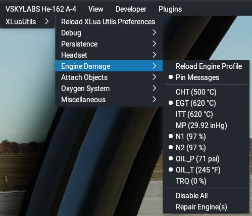

## XLuaUtils Engine Damage Utility

This document contains information about XLuaUtils' "Engine Damage" utility.

[Back to Readme.md](../README.md) 

&nbsp;

<a name="toc"></a>
### Table of Contents
1. [Introduction](#1)  
1. [Design Concept](#2)   
1. [Engine Profile](#3)   
1. [Menu](#4)   
1. [Usage](#5)   
1. [Configuration](#6)

&nbsp; 

<a name="1"></a>
### 1. Introduction

"Engine Damage" uses engine parameter redline limits from default datarefs (i.e. the aircraft's _.acf_ file) or from override values stored in an engine profile file (see below) in case that no sensible limits were set by the original aircraft author.   
Each supported parameter can be enabled individually to adapt "Engine Damage" to a given engine type.
Engine damage accumulation is dynamic, determined by the amount of redline exceedance and some randomization.  
Engine failure due to stress is probabilistic, with the chance being greater the more stress an engine accumulates.

&nbsp;

[Back to table of contents](#toc) 

&nbsp;

<a name="2"></a>
### 2. Design Concept

#### 2.1 Supported Parameters

The supported engine parameters for "Engine Damage" are:
- cylinder head temperature (CHT)
- exhaust gas temperature (EGT)
- interstage turbine temperature (ITT)
- manifold pressure (MP)
- first spool (or prop) rotation speed (N1)
- second spool (or engine) rotation speed (N2)
- oil pressure (OIL_P)
- oil temperature (OIL_T)
- propeller RPM (RPM_P)
- Torque (TRQ)

Any of these can be enabled at any time. However, there should be a sensible limit set in the _.acf_ file (and detected from a dataref) or set in the engine profile.

&nbsp;

#### 2.2 Caveats/Drawbacks

For mixed engine type aircraft, e.g. piston and jet engines, parameters peculiar to each engine type will have to be enabled at the same time. "Engine Damage" will evaluate each of these parameters for each engine. Correct handling of redline values for each engine type mounted on the aircraft is therefore exclusively up to X-Plane. 

I may also have overdone the randomization, but I like randomization too much as things would get boring otherwise.

&nbsp;

#### 2.3 Base values

The red line limit for a supported parameter, supplied by the dataref or override value, serves as a baseline with a given normal durability, in seconds. For example, the engine stress at a redline value for N1 at 100% can be tolerated for 300 seconds (or 5 minutes) before failure. This value pair (engine parameter and associated time) is used as the lower limit by "Engine Damage".   
As this would make things too predictable and not dynamic enough, a second value pair is used in the form of a scalar for the redline value and a second time parameter, which, for example, scales a 100% N1 redline by 1.25 to obtain 125 % N1. At this N1, the engine would last, say, 10 seconds. This engine parameeter - time value pair is used as the upper limit by "Engine Damage"   
Engine damage interpolates between these two value pairs to obtain the time the engine lasts at the current value. To stick with the example, a N1 of 110 % would yield around 200 seconds of time to failure.  

&nbsp;

#### 2.4 Randomization

To make things more unpredictable and avoid simultaneous engine failure in multi engine aircraft, the upper and lower limits (engine parameter and stress tolerance time) are randomized between 98 % and 104 % (defaults) of their nominal value during each aircraft (re)load.   
The slope between the randomized values for the linear interpolation is calculated and stored per flight session to save a few CPU cycles.

&nbsp;

#### 2.5 Stress recession

Since it's easier to add stress to an engine than remove it, there is a separate parameter to scale the current stress rate when engine stress is receding. This parameter is set in the engine profile (see below) and randomized each flight session between 98 % and 102 % of the nominal value.

&nbsp;

#### 2.6 Engine monitoring

"Engine Damage" will loop through all available engines on the aircraft and, if the particular engine has not failed, will monitor said engine for all enabled parameters.   
The currently monitored parameter is checked against its nominal base limit (as specified by the dataref or engine profile) and, if an exceedance is recorded, engine stress will be accumulated at a rate determined by the (previously randomized) slope between the (previously randomized) lower and upper limits.  
A notification will be displayed for a few seconds or, if pinned, as long as the engine is accumulating stress.   
If the given engine parameter falls below the redline parameter, engine stress will decrease by the randomized stress recess rate. Therefore, there is a chance that a subsequent redline exceedance will start with the previously accumulated stress.  
Accumulated engine stress can not exceed the maximum stress tolerance limit based on the (previously randomized) upper limit and can not be lower than zero.

&nbsp;

#### 2.7 Engine Failure

When an engine has accumulated stress greater than zero, there is a chance of failure. At the lower engine limit, the default chance is 0.0001, i.e. 1 in 10000 per second (which is the default script refresh rate), while at the upper limit, the default chance is 1 in 100 per second. The failure chance is linearly interpolated between these limits.    
The failure system uses a "lucky number" between 1 and 10, which is assigned to each monitored parameter of each engine during module initialization at each aircraft (re)load. Each script update cycle, this "lucky number" is compared against a randomly picked number from a pool whose size is determined by the current engine stress level.  
When the "lucky number" matches the randomly picked number, the engine will fail.   
The failure mode depends on the engine parameter that caused the failure. Supported modes are:
- Engine fire (CHT, EGT, ITT, oil temperature)
- Loss of power (N1, N2)
- Oil pump failure (oil pressure)
- Propeller detachment (propeller RPM)
- Shaft breakage (torque)

A notification will be displayed for 60 seconds (default) when an engine fails.

&nbsp;

#### 2.8 Engine Repair

All engine damage may be repaired at any time from the menu to avoid frustration. Be your own game master!


&nbsp;

[Back to table of contents](#toc)

&nbsp;

<a name="3"></a>
### 3. Engine Profile

#### 3.1 File Information

An engine profile file is stored in _"[Aircraft folder]/plugins/xlua/scripts/xluautils/engine_profile.cfg"_.   
This file can be edited with any text editor and is generated when "Engine Damage" is initialized. Its file header contains information regarding line structuring and more.

Example _"engine_profile.cfg"_ files for some aircraft can be found in _"xluautils/Config Files/Engine Damage"_. These may be used as a starting point or template. Contributions are welcome.

&nbsp;

#### 3.2 Parameter Lines 

"DMG_" lines contain data for a given supported engine parameter (see section "Supported Parameters"). All of these lines share the same amount and order of values:
	
	DMG_CHT,0,-1,°C,1.5,300,10,0.75

|Value Index|Value (Range)|Description|
|-|-|-|
|1|"DMG_xxx"|"DMG_" plus the identifier of the engine parameter (e.g. "DMG_EGT")|
|2|1 or 0|1: The given parameter is monitored|
|3|-1 or > 0|-1: Use dataref/_.acf_ parameter limit, any other value: Use the specified limit. Value must be greater than zero.|
|4|[See table below]|The unit used for the manual limit (value 3). See table below for supported units.|
|5|> 1.0|Scalar for the parameter limit at index 3 to obtain the upper limit (see section "Base values")|
|6|> 0|Time (in seconds) for which the engine can take stress when this engine parameter is at the lower limit specified at index 3|
|7|> 0 and < [time at upper limit]|Time (in seconds) for which the engine can take stress when this engine parameter is at the upper limit calulated from index 3 and 4|
|8|> 0|The current engine stress accumulation rate is scaled by this value when engine stress is decreasing|

&nbsp;

These units may be used for manual limits for "DMG_" properties in _engine_damage.cfg_:
- CHT, EGT, ITT, OIL_T: °C, °F
- MP: inHg
- N1, N2: %
- OIL_P: psi
- RPM_P: 1/min
- TRQ: %, Nm, lb-ft

If no manual limit is specified, the unit will be determined by the dataref.  
Mistyped or unsupported units will be ignored.  


&nbsp;

"Randomize" lines control engine parameter randomization:

	RandomizeLimit,0.98,1.04

|Value Index|Value (Range)|Description|
|-|-|-|
|1|"Randomize[Limit/Damage]"|Line identifier. "Limit" randomizes the engine parameter's limitss, while "Damage" (at the moment) randomizes an engine parameter's stress recession rate|
|2|< 1.0|Lower end of the Limit/Damage randomization range|
|3|> 1.0|Upper end of the Limit/Damage randomization range|

&nbsp;

The "FailureChance" line controls the failure chance for this aircraft's engines:

	FailureChance,0.001,0.1

|Value Index|Value (Range)|Description|
|-|-|-|
|1|"FailureChance"|Line identifier|
|2|< 1.0|Failure chance at the lower limit of the engine stress range. Divide 1 by this value to get your failure chance (1 in n) per second. 1.0 provides a virtually guaranteed failure|
|3|< 1.0|Failure chance at the upper limit of the engine stress range. Divide 1 by this value to get your failure chance (1 in n) per second. 1.0 provides a virtually guaranteed failure|


&nbsp;

[Back to table of contents](#toc)

&nbsp;

<a name="4"></a>
### 4. Menu

The _"Engine Damage"_ submenu is available when a _"persistence.cfg"_ file was found during XLuaUtils' initialization.



|Menu Item|Description|
|-|-|
Generate/Reload Engine Profile|Click to write or read _plugins/xlua/scripts/xluautils/engine_profile.cfg_  
Pin Messages|When active, engine failure notifications will remain on screen instead of disappearing after a set time (see "Configuration" below).  
CHT ... TRQ|Shows the available properties that can be monitored and their limit and unit as determined from the datarefs or _engine_profile.cfg_. Click to toggle monitoring of this parameter. **Caution:** Will rewrite _engine_profile.cfg_!  
Disable All|Turns of monitoring of all enabled parameters
Repair Engine(s)|Clears all engine failures. Note that all failed engines will have to be restarted again!

&nbsp;

[Back to table of contents](#toc)

&nbsp; 

<a name="5"></a>
### 5. Usage

1. Generate an engine profile file with "Generate Engine Profile" from the menu.   
 **Warning:** An existing _engine_profile.cfg_ file will be overwritten, so back up your old one before!
2. If happy with all default values, simply enable the parameters you wish to have monitored from the menu   
or   
Apply any overrides and enable parameters within _engine_profile.cfg_, then use "Reload Engine Profile" from the menu to read and apply the overrides. **Warning:** Do not use the "CHT" ... "TRQ" or "Disable All" menu before finishing your edits and reloading _engine_profile.cfg_ or your customized file will be overwritten!
3. Test fly your aircraft. I'm 99 % sure you will try to test the engines' limits.

&nbsp;

[Back to table of contents](#toc)

&nbsp; 
 
<a name="6"></a>
### 6. Configuration

"Engine Damage" can be configured in _"plugins/xlua/scripts/xluautils/preferences.cfg"_. Relevant lines:

```
ENGINEDAMAGE,MainTimerInterval:string,1:number
ENGINEDAMAGE,Notify_Pin:string,1:number
ENGINEDAMAGE,Notify_Time:string,30:number
```

&nbsp;

Parameter|Value Range|Description
-|-|-
MainTimerInterval|> 0|Sets the refresh interval, in seconds, for Engine Damage's main timer. Should be greater than zero. **Warning:** The lower the interval, the more frequent the failure chance calculation and thus the higher the chance of engine failure!
Notify_Pin|1 or 0|Same as the menu's "Pin Messages" item
Notify_Time|> 0|Sets how long a notification will be displayed if "Pin Messages" is *not* enabled

&nbsp;

[Back to table of contents](#toc)