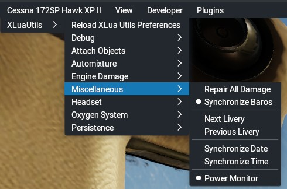

## Xlua Utils noise-cancelling headset utility

This document contains information about miscellaneous small utilities contained within Xlua Utils.

[Back to Readme.md](../README.md) 

&nbsp;

### Table of Contents
1. [Menu/Functionality](#1)   
2. [Configuration via Preferences.cfg](#2)   

&nbsp;
 
 
### 1. Menu/Functionality

- _"Repair All Damage"_ resets all 500+ of X-Plane's failure datarefs to a value of zero (from a value of six, indicating a failure). Aircraft must be standing still on the ground with all engines off in order to use this. If the aircraft can not be repaired, the menu entry will read _"[Can Not Repair]"_.
- _"Synchronize Baros"_, when enabled, will synchronize the pilot, co-pilot and standby barometers when either of these are adjusted.

&nbsp;

[Back to table of contents](#toc)

&nbsp;

### 2. Configuration via Preferences.cfg

These are the persistence module parameters which are stored in lines prefixed with "MISC_UTILS" in _"preferences.cfg"_:

- `MainTimerInterval:string,1:number`   
Update interval of the main timer for the miscellaneous utilities (in seconds; default: 1)

- `SyncBaros:string,0:number`
Synchronize barometric settings between altimeters disabled/enabled  (0/1; default: 0)

&nbsp;

[Back to table of contents](#toc)

&nbsp;