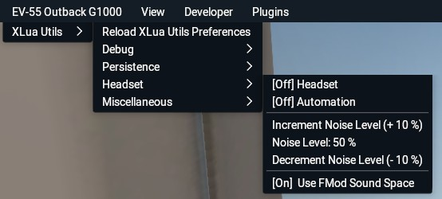

## Xlua Utils noise-cancelling headset utility

This document contains information about Xlua Utils' noise-cancelling headset utility.

[Back to Readme.md](../README.md) 

&nbsp;

### Table of Contents
1. [Features](#1)  
2. [Known Issues](#2)  
3. [Menu/Functionality](#3)   
4. [Configuration via Preferences.cfg](#4)   

&nbsp;

### 1. Features

The noise-cancelling function can be toggled from the menu or enabled/disabled automatically. When automated, the headset is only active when all engines are running.

Volume levels from the beginning of the X-Plane session are stored during module initialization for later restoration. These volume levels are restored during X-Plane's "aircraft_unload" event, e.g. when changing aircraft or shutting down X-Plane.

&nbsp;

[Back to table of contents](#toc)

&nbsp;

### 2. Known issues

Reloading the aircraft or its Lua scripts, or an X-Plane program crash with the NC function active will prevent the volume level restoration logic from running. Thus, the volume levels present at script initialization will be considered defaults and noise-cancelling will be applied to the, leading to much lower than desired sound levels requiring manual restoration from X-Plane's sound menu.

&nbsp;

[Back to table of contents](#toc)

&nbsp;

### 3. Menu/Functionality

The _"Headset"_ submenu is available when a _"persistence.cfg"_ file was found during XLua Utils' initialization.

- _"[On/Off] Headset"_   
Immediately puts on the headset, decreasing all non-ATC noise levels to the set level (see below). When set to off, it will also turn off headset automation.
- _"[On/Off] Automation"_   
When enabled, will automatically put on the headset once all engines are started.
- _"Increment Noise Level (+ n %)"_   
Increments the headset noise level by a certain percentage which may be adjusted in _"preferences.cfg"_ (see below).
- _"Noise Level: n %"_   
Only displays the current headset noise level and does not constitute an interactive element.
- _"Decrement Noise Level (- n %)"_   
Decrements the  headset noise level by a certain percentage which may be adjusted in _"preferences.cfg"_ (see below).
- _"[On/Off] Use FMod Sound Space"_   
When on, the dataref *"sim/operation/sound/inside_any"* is used to determine whether the user is inside the aircraft or not. When off, *"sim/graphics/view/view_is_external"* is used.

&nbsp;

[Back to table of contents](#toc)

&nbsp;

### 4. Configuration via Preferences.cfg

These are the persistence module parameters which are stored in lines prefixed with "NCHEADSET" in _"preferences.cfg"_:

- `Automation:string,0:number`   
Automated headset usage disabled/enabled (0/1; default: 0)

- `HeadsetOn:string,0:number`   
Headset usage disabled/enabled (0/1; default: 0)

- `NoiseCancelLevel:string,0.5:number`   
Volume level of outside noise (0 to 1; default 0.5)

- `NoiseCancelLevelDelta:string,0.1:number`   
Increment/Decrement of volume level adjustment (0<>1; default: 0.1)

- `MainTimerInterval:string,1:number`   
Timer interval for headset automation checks (in seconds; default: 1)

- `FModCompliant:string,1:number`   
Use Fmod soundscape to determine if user is inside the aircraft disabled/enabled  (0/1; default: 1)

When altering these parameters, only adjust the numbers and nothing else.   
Changes to _"preferences.txt"_ can be applied immediately with the _"Reload XLua Utils Preferences"_ from the _"XLua Utils"_ menu.

&nbsp;

[Back to table of contents](#toc)

&nbsp;
