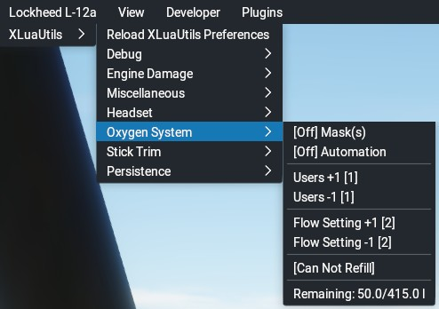

## XLuaUtils Oxygen System Utility

This document contains information about XLuaUtils' oxygen system utility.

[Back to Readme.md](../README.md) 

&nbsp;

### Table of Contents
1. [Features](#1)  
2. [Known Issues](#2)  
3. [Menu/Functionality](#3)   
4. [Configuration via Preferences.cfg](#4)   

&nbsp;

### 1. Features

The Oxygen System utility is basically a user interface for various default X-Plane datarefs and provides some degree of automation.    
It also provides popup notifications that will inform the pilot about the onset (above 14,000 ft felt altitude) and impairment (above 15,000 ft felt altitude) of hypoxia.    
When the system is enabled, the pilot will be informed when the fill level in the bottle(s) is down to 75%, 50%, 25% and 0%.
With the oxygen system enabled (mask on) oxygen flow will be automatically increased when the pilot is above 10000 ft felt altitude and will be decreased when the pilot is below 8000 ft felt altitude.

&nbsp;

[Back to table of contents](#toc)

&nbsp;

### 2. Known issues

At first use, the oxygen bottle will be filled to just 50 l. In case the aircraft has a bigger bottle installed, simply click _"Refill Bottle"_ before going on your first flight. After that, the oxygen volume in the bottle will be tracked persistently.

&nbsp;

[Back to table of contents](#toc)

&nbsp;

### 3. Menu/Functionality

The _"Oxygen System"_ sub-menu is available when a _"persistence.cfg"_ file was found during XLuaUtils' initialization.

- _"[On/Off] Masks"_   
Immediately puts on the oxygen mask. When set to off, it will also turn off mask automation.
- _"[On/Off] Automation"_   
When enabled, will automatically put on the oxygen mask above 12500 ft.
- _"Users +1 [n]"_   
Increments the number of oxygen users by 1. Should be adjusted to the number of people on board that require oxygen (probably all). The number in square brackets is the current number of users.
- _"Users -1 [n]"_   
Decrements the number of oxygen users by 1. The number in square brackets is the current flow setting.
- _"Flow Setting +1 [n]"_   
Increments the oxygen flow setting by one, decreasing the effects of hypoxia more quickly at the cost of increased oxygen consumption. The number in square brackets is the current flow setting.
- _"Flow Setting -1 [n]"_   
Decrements the oxygen flow setting by one. The number in square brackets is the current flow setting.
- _"Refill Bottle"/"[Can Not Refill]"_   
When on the ground, click here to refill the oxygen bottle to full capacity.
- _"Remaining: n/m l"_   
Just for information: The remaining and total capacity of the oxygen bottle on board, in litres.

&nbsp;

[Back to table of contents](#toc)

&nbsp;

### 4. Configuration via Preferences.cfg

These are the persistence module parameters which are stored in lines prefixed with "OXYGENSYSTEM" in _"preferences.cfg"_:

- `Automation:string,0:number`   
Automated oxygen system usage disabled/enabled (0/1; default: 0)

- `MasksOn:string,0:number`   
Oxygen system disabled/enabled (0/1; default: 0)

- `MainTimerInterval:string,1:number`   
Timer interval for headset automation checks (in seconds; default: 1)

- `BottleCapacityLiters:string,50:number`   
The capacity of the oxygen bottle, if not defined in PlaneMaker (in litres; default: 50)

- `BottleRemainingLiters:string,50:number`   
The remaining amount of oxygen in the bottle (in litres)

- `FlowSetting:string,2:number`   
The flow setting for the oxygen mask (0 to 8; default: 2)

- `Users:string,1:number`   
The number of users connected to the oxygen system (default: 1)

- `PilotAltitude:string,10000:number,8000:number`   
The felt altitudes at which the oxygen flow will be automatically increased (first value) and decreased (second value) (in feet; default: 10000, 8000)

When altering these parameters, only adjust the numbers and nothing else.   
Changes to _"preferences.cfg"_ can be applied immediately with the _"Reload XLuaUtils Preferences"_ from the _"XLuaUtils"_ menu.

&nbsp;

[Back to table of contents](#toc)

&nbsp;
