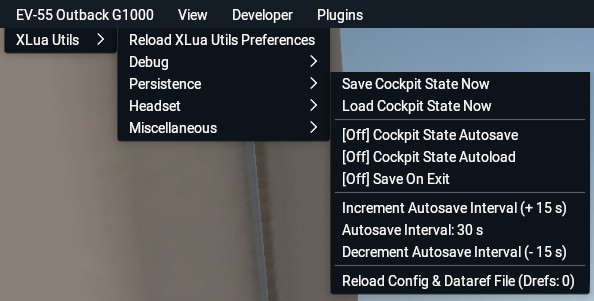

## XLuaUtils persistence utility

This document contains information about XLuaUtils' persistence utility.

[Back to Readme.md](../README.md) 

&nbsp;

### Table of Contents
1. [Caveats/Known Issues](#1)   
2. [Files](#2)   
3. [Populating Persistence_datarefs.cfg](#3)  
4. [Menu/Functionality](#4)   
5. [Configuration via Preferences.cfg](#5)   

&nbsp;

### 1. Caveats/Known Issues

The persistence system comes with the following caveats:

- Datarefs that are present in X-Plane 11 may not be present in X-Plane 12. As missing datarefs are discarded during persistence module initialization, they will not be saved later on.
- Engine-related datarefs are hard to initialize, so it's best to disregard in-flight situations as initialization with running engines will most likely not work. The persistence module was made primarily ground-based state saving between X-Plane sessions.
- Custom datarefs created by third party aircraft must be writable in order to be used by the persistence module. If a third-party aircraft uses XLua or SASL to drive its systems, it may be that its custom datarefs are not initialized with a handler which would make them writable (if a custom dataref can be edited with DataRefTool, it is writable).   
For XLua, _"xluautils/Config Files/Persistence/OliXSim L-18 1.1"_ provides a workaround in form of a modified _"init.lua"_ file for XLua 1.0, in which the "create_dataref" function will initialize **any** custom dataref as writable.   
There is no such thing for SASL driven aircraft, so users may be out of luck in the worst case.
- Despite all the care taken in finding the correct datarefs and putting them into a sensible order, it may be that some third party aircraft simply do not react too well toward third party tools trying to write to their datarefs.   
In general, the simpler the add-on, the higher the chance of success for a 100% correct initialization.
- FMS and GPS flight plans and configurations are not supported unless they are stored within datarefs.
- There is no way to restore dataref values from the start of the X-Plane session prior to persistence file reading, so the only solution to a messed up persistence save file is deleting *"persistence_save.txt"*, disabling persistence auto-loading and restarting X-Plane or changing to another aircraft and back and start over.

&nbsp;

[Back to table of contents](#toc) 

&nbsp;

### 2. Files 

Relevant files to this module are stored in _"xluautils"_ and are _"preferences.cfg"_, storing configuration data, _"persistence_datarefs.cfg"_, a manually populated list of datarefs and _"persistence_save.txt"_, the save file containing the dataref values.

&nbsp;

[Back to table of contents](#toc) 

&nbsp;

### 3. Populating Persistence_Datarefs.cfg

An empty _"Persistence_datarefs.cfg"_ is generated at XLuaUtils initialization (see chapter [5.1](#5.1) if none is present.   

- _"Persistence_datarefs.cfg"_ is a regular text file and can be opened with any text editor like Notepad (apps like MS Word are not recommended though).
- The header section of _"persistence_datarefs.cfg"_ contains information on how to find datarefs used by the current aircraft.
- The best techniques for finding datarefs used by the aircraft are using [DataRefTool](https://datareftool.com/) to filter datarefs that recently changed due to user input, analysing cockpit related _.obj_ files in the _"objects"_ folder of the aircraft and finding relevant datarefs in the _"...cockpit.obj"_ file in the aircraft's root folder by searching for a switch's tool tip.
- Custom datarefs created by third party add-ons are supported.
- Invalid datarefs that can not be found in X-Plane are discarded during the initial parsing of _"persistence_datarefs.cfg"_ and will not be used, so there is minimal risk of crashing X-Plane.
- Only the name of the dataref is required, even if it is an array.
- Commands are not supported. This should be kept in mind when analyzing _"...cockpit.obj"_ files.
- There is no limit to the number of datarefs in _"persistence_datarefs.cfg"_.
- Comments are denoted with a hash sign ("#") at the beginning of a line.
- Dataref order may matter if the aircraft's systems logic dictates one.

Example _"persistence_datarefs.cfg"_ files for some add-on aircraft can be found in _"xluautils/Config Files/Persistence"_. These may be used as a starting point or template. Contributions are welcome.

&nbsp;

[Back to table of contents](#toc) 

&nbsp;

### 4. Menu/Functionality

The _"Persistence"_ sub-menu is available when a _"persistence.cfg"_ file was found during XLuaUtils' initialization.

 

- _"Save Cockpit State Now"_   
Saves the tracked datarefs' values to _"xluautils/persistence_save.txt"_
- _"Load Cockpit State Now"_   
Loads the tracked datarefs' values from _"xluautils/persistence_save.txt"_
- _"[On/Off] Cockpit State Autosave"_   
Toggles the timed autosave feature on/off.   
The first autosave is performed after a certain delay to avoid conflicts with other XLuaUtils file access functions.   
After the first autosave, a timer is started that will save the persistence state in a specific interval.   
See below for adjustment of the initial autosave delay and autosave interval.
- _"[On/Off] Cockpit State Autoload"_   
Toggles the autoload feature on/off.   
Autoloading of persistence data from *"persistence_save.txt"* is started during X-Plane's "flight_start" event during aircraft initialization.   
To avoid conflicts with custom systems logic from other scripts or plugins, autoload is performed after a certain delay, which may be configured in _"preferences.cfg"_ (see below).
- _"[On/Off] Save On Exit"_   
Triggers a persistence save operation during X-Plane's "aircraft_unload" event, e.g. when shutting down X-Plane or changing aircraft.
- _"Increment Autosave Interval (+ n s)"_   
Increments the autosave interval by a certain amount of time which may be adjusted in _"preferences.cfg"_ (see below).
- _"Autosave Interval: n s"_   
This only displays the current autosave interval and does not constitute an interactive element.
- _"Decrement Autosave Interval (- n s)"_   
Decrements the autosave interval by a certain amount of time which can be adjusted in _"preferences.cfg"_ (see below).
- _"Reload Config & Dataref File (Drefs: n)"_    
Reads persistence module related data from _"preferences.cfg"_, parses _"persistence_datarefs.cfg"_ and then reads the current values of all tracked datarefs. The menu entry will display the amount of currently tracked datarefs.

&nbsp;

[Back to table of contents](#toc) 

&nbsp;

### 5. Configuration via Preferences.cfg

These are the persistence module parameters which are stored in lines prefixed with "PERSISTENCE" in _"preferences.cfg"_:

- `Autoload:string,0:number`   
Autoload disabled/enabled (0/1; default: 0)

- `AutoloadDelay:string,5:number`   
Autoload delay (in seconds; default: 5)

- `Autosave:string,0:number`   
Autosave disabled/enabled (0/1; default: 0)

- `AutosaveInterval:string,30:number`   
Autosave interval (in seconds; default: 30)

- `AutosaveIntervalDelta:string,15:number`   
Increment/decrement for the autosave interval adjustment (in seconds; default: 15)

- `AutosaveDelay:string,10:number`   
Delay before first autosave (in seconds; default: 10)

- `SaveOnExit:string,0:number`   
Save on aircraft unload disabled/enabled (0/1; default: 0)

When altering these parameters, only adjust the numbers and nothing else.   
Changes to _"preferences.cfg"_ can be applied immediately with the _"Reload Config & Dataref File"_ function from the _"Persistence"_ menu or the _"Reload XLuaUtils Preferences"_ from the _"XLuaUtils"_ menu.

&nbsp;

[Back to table of contents](#toc) 

&nbsp;
