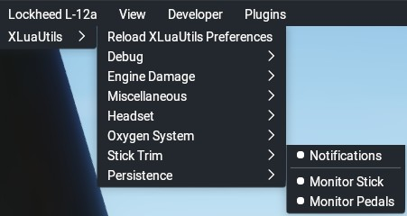

## XLuaUtils Stick Trim

This document contains information about XLuaUtil's stick trim utility.

[Back to Readme.md](../README.md) 

&nbsp;

### Table of Contents
1. [Features](#1)  
2. [Known Issues](#2)  
3. [Menu/Functionality](#3)   
4. [Usage](#4)   

&nbsp;

### 1. Features/Usage

“Stick Trim” allows trimming the aircraft with the control stick/yoke/cyclic or pedals by means of the custom _”xluautils/stick_trim”_ command.

&nbsp;

[Back to table of contents](#toc)

&nbsp;

### 2. Known issues

No configuration with _"preferences.cfg"_.

&nbsp;

[Back to table of contents](#toc)

&nbsp;
 

### 3. Menu/Functionality

Menu Item|Function
-|-
Notifications|Enables/disables notifications sent by Stick Trim.
Monitor Stick|Enables/disables Stick Trim's stick/yoke/cyclic channel
Monitor Pedals|Enables/disables Stick Trim's rudder/pedal channel

&nbsp;

[Back to table of contents](#toc)

&nbsp;

### 4. Usage

#### 4.1 Prerequisite

In order to use Stick Trim, the _”xluautils/stick_trim”_ command must be assigned to a key or controller button.

#### 4.2 Trimming

When you’re flying the aircraft and wish to trim out the current stick/yoke/cyclic or pedal deflection:
1. Press the button/key assigned to the "stick_trim” command.
1. Move the stick/yoke/cyclic or pedals to the centered position.
1. Release the button/key.

The control deflection will then be automatically converted into trim deflection.   
If enabled, a notification will inform you that the aircraft was trimmed.

#### 4.3 Resetting the trim
A short press on the “stick_trim” key/button will reset all trims to neutral.   
If enabled, a notification will inform you that the trims were reset.

&nbsp;

[Back to table of contents](#toc)

&nbsp;