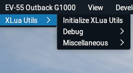

# XLuaUtils for X-Plane 11/12

XLuaUtils is a collection of scripts and utilities for X-Plane's [XLua plugin](https://github.com/X-Plane/XLua), implemented as a companion script. XLuaUtils extends XLua's capabilities for demonstrating interaction with X-Plane's C API by means of [LuaJIT](https://luajit.org/)'s [Foreign Function Interface](https://luajit.org/ext_ffi.html) (FFI).   
It can be installed and used in any X-Plane 11/12 aircraft

It also implements wrappers for some paths, logging, notifications, dataref interaction and debug information, which can help aircraft developers during development of XLua scripts.

The persistence and noise-cancelling headset modules, as well as some miscellaneous utilities are aimed at end users who seek to get more out of an aircraft.

&nbsp;

## Table of Contents
1. [Requirements](#1.0)
2. [Installation](#2.0)
3. [Uninstallation](#3.0)
4. [Developer Reference](#4.0)    
5. [End-User Utilities](#5.0)   
5.1 [Initialization/Main Menu](#5.1)   
5.2 [Persistence](#5.2)   
5.3 [Noise-Cancelling Headset](#5.3)   
5.4 [Miscellaneous Utilities](#5.4)   
5.5 [Automixture Controls](#5.5)   
5.6 [Attach Objects](#5.6)   
5.7 [Engine Damage](#5.7)   
5.8 [Oxygen System](#5.8)   
6. [License](#6.0)

&nbsp;

## 1 - Requirements

- [X-Plane](https://www.x-plane.com/)  (11 or 12)
- [XLua](https://github.com/X-Plane/XLua) (1.0 or higher; only works locally on a single aircraft)

&nbsp;

[Back to table of contents](#toc)

&nbsp;

## 2 - Installation

### 2.1 Aircraft without an XLua plugin

- Copy the *"xlua"* folder from, e.g. _"[Main X-Plane folder]/Aircraft/Laminar Research/Cessna 172SP/plugins"_ into the _"plugins"_ folder of the aircraft that you wish to use XLuaUtils with.
- Delete all subfolders from the _"[Aircraft's main folder]/plugins/xlua/scripts"_ folder.
- Copy the _"xluautils"_ folder into _"[Aircraft's main folder]/plugins/xlua/scripts"_

### 2.2 Aircraft with an XLua plugin

- Copy the _"xluautils"_ folder into _"[Aircraft's main folder]/plugins/xlua/scripts"_

### 2.3 Post-Installation

XLuaUtils is working correctly if X-Plane's main menu bar contains a menu with the aircraft's name and an _"XLuaUtils"_ submenu (see chapter [5.1](#5.1)).

If you have no intention of using XLuaUtils for development purposes, consult [section 5](#5.0) of this readme to learn about the end-user oriented tools.
A quick read of [section 4](#4.0) is recommended regardless, because some information there may come in handy at some point.

&nbsp;

[Back to table of contents](#toc)

&nbsp;

## 3 - Uninstallation

Delete the _"xluautils"_ folder from _"[Aircraft's main folder]/plugins/xlua/scripts/"_

&nbsp;

[Back to table of contents](#toc)

&nbsp;

## 4 - Developer Reference

XLuaUtils provides a range of useful functions for XLua developers to help debug code or implement utilities.   
See the [Documentation/Developer_Reference.md](Documentation/Developer_Reference.md) document for more information.

&nbsp;

[Back to table of contents](#toc)

&nbsp;

## 5 - End-User Utilities

### 5.1 Initialization/Main Menu

After a successful installation, the main X-Plane menu bar contains a menu with the aircraft's name with a _"XLuaUtils"_ submenu.

- _"Initialize XLuaUtils"_ will generate a _preferences.cfg_ file containing the initial values of any submodule making use of XLuaUtils' preferences system (see [Documentation/Developer_Reference.md](Documentation/Developer_Reference.md), section 4).   
Note that some XLuaUtils elements or submodules do not initially save their state and will require changing their settings before they will do so.   
 _"Reload XLuaUtils Preferences"_ will replace _"Initialize XLuaUtils"_ as a menu entry if a _"preferences.cfg"_ file was created during initialization or if the file has been detected at startup. Clicking will read the current values from _"preferences.cfg"_.   
Use this function to reload preferences values that have been altered via manual edit of the file.

- The _"Debug"_ submenu is always visible and contains controls for debug-level logging (see [Documentation/Developer_Reference.md](Documentation/Developer_Reference.md), section 3)  and the debug window ([Documentation/Developer_Reference.md](Documentation/Developer_Reference.md), section 7).

&nbsp;

### 5.2 Persistence

XLuaUtils' persistence module parses a list of datarefs at startup, whose values are either manually or automatically written to a persistence state file. This state file is then parsed at X-Plane session initialization and the values are written back to these datarefs. The module only works for the aircraft running XLuaUtils (i.e. the currently active user aircraft).

See [Documentation/Persistence.md](Documentation/Persistence.md) for more information.

&nbsp;

[Back to table of contents](#toc)

&nbsp;

### 5.3 Noise-Cancelling Headset

XLua Util's noise-cancelling headset module provides a customizable one-size-fits all solution to loud engines. It decreases engine, environment, exterior, fan, ground, interior, prop, warning and weather volume levels, while retaining the sound level of the co-pilot, master slider, radio and ui. The headset will only affect volume levels when inside a sound space (properly set up fmod soundsets) or in an interior view (fallback mode).

See [Documentation/NCHeadset.md](Documentation/NCHeadset.md) for more information.

&nbsp;

[Back to table of contents](#toc)

&nbsp;

### 5.4 Miscellaneous Utilities

Various smaller utilities.

See [Documentation/Misc_Utils.md](Documentation/Misc_Utils.md) for more information. 

&nbsp;

[Back to table of contents](#toc)

&nbsp;

### 5.5 Automixture Controls

As of version 12.00, X-Plane does not support complex automatic mixture controllers as found, for example on [Pratt & Whitney R-1830 type engines](https://www.enginehistory.org/Piston/P&W/R-1830/r-1830.shtml) of Douglas DC-3s and C-47s. These automatic controllers, in their "Auto Lean" and "Auto Rich" modes, automatically set the fuel mixture based on altitude to attain a specific [air-fuel-ratio](https://en.wikipedia.org/wiki/Air%E2%80%93fuel_ratio), easing crew workload and ensure maximum power or fuel saving.

XLuaUtils has an automixture utility modeled after the R-1830's mixture controller with the following modes:
- Manual: Manual mixture control
- Idle Cutoff: Turns off the engine(s)
- Auto Lean: Lean mixture (default air-fuel-ratio: 16.5) for fuel economy during cruise
- Auto Rich: Rich mixture (default air-fuel-ratio: 12.5) for maximum power for takeoff
- Full Rich: Maximum fuel consumption, but the excess fuel provides cylinder head cooling for situations with maximum power demands

While X-Plane (12) offers a FADEC-based automixture control for reciprocating engines, the controller only offers a "maximum power" target, i.e. "Auto Rich" mode. Therefore, I felt it was necessary to code a custom solution.

To offer seamless integration into aircraft models, the utility comes with a built-in capability to modify object files, primarily in order to implement detents for mixture levers. This offers a possibility for realistic in-cockpit operations without having to resort to an external menu.

See [Documentation/Automixture.md](Documentation/Automixture.md) for more information. 

&nbsp;

[Back to table of contents](#toc)

&nbsp;

### 5.6 Attach Objects

The object attachment utility can be used to display objects loaded from object files outside the aircraft.   
These objects can be set to display within a certain dataref value range and will either move with the aircraft (e.g. external loads) or stick to the ground (e.g. ground equipment).   
Object definition is provided from a simple text-based input file and objects can be reloaded at any time.

See [Documentation/Attach_Objects.md](Documentation/Attach_Objects.md) for more information. 

&nbsp;

[Back to table of contents](#toc)

&nbsp;

### 5.7 Engine Damage
 
The engine damage utility will add consequences to exceeding operational limitations.   
These limitations depend on engine type (e.g. torque and CHT for props, ITT and EGT for jets, etc.) and are either derived from the aircraft's ACF file or by user-specific thresholds.

See [Documentation/Engine_Damage.md](Documentation/Engine_Damage.md) for more information. 

&nbsp;

[Back to table of contents](#toc)

&nbsp;

### 5.8 Oxygen System
 
Provides a supplemental oxygen system (or an override for a present oxygen system) without having to edit an aircraft's PlaneMaker model.   
Has an automation mode and provides warnings about pilot hypoxia.

See [Documentation/Oxygen_System.md](Documentation/Oxygen_System.md) for more information. 

&nbsp;

[Back to table of contents](#toc)

&nbsp;

## 6 - License

XLuaUtils is licensed under the European Union Public License v1.2 (see _EUPL-1.2-license.txt_). Compatible licenses (e.g. GPLv3) are listed  in the section "Appendix" in the license file.

[Back to table of contents](#toc)