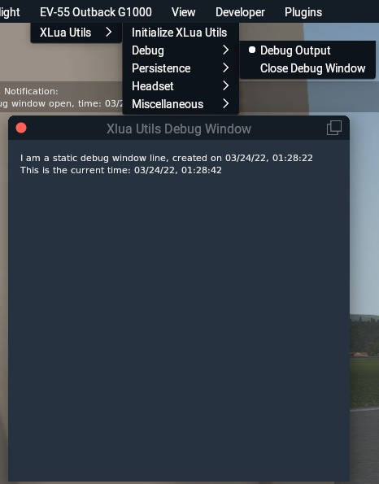

# XLuaUtils for X-Plane 11/12

This is a collection of scripts and utilities for X-Plane's [XLua plugin](https://github.com/X-Plane/XLua), implemented as a cohesive companion utility. XLua Utils extends XLua's capabilities for demonstrating interaction with X-Plane's C API by means of [LuaJIT](https://luajit.org/)'s [Foreign Function Interface](https://luajit.org/ext_ffi.html) (FFI).   
It can be installed and used in any X-Plane 11/12 aircraft

It also implements wrappers for some paths, logging, notifications, dataref interaction and debug information, which can help aircraft developers during development of XLua scripts.

The persistence and noise-cancelling headset modules, as well as some miscellaneous utilities are aimed at end users who seek to get more out of an aircraft.

&nbsp;

## Table of Contents
1. [Requirements](#1.0)
2. [Installation](#2.0)
3. [Uninstallation](#3.0)
4. [Development Reference](#4.0)    
4.1 [Limitations](#4.1)   
4.2 [Global Variables and Paths](#4.2)   
4.3 [Logging](#4.3)   
4.4 [Preferences](#4.4)   
4.5 [Menus](#4.5)   
4.6 [Notifications](#4.6)   
4.7 [Debug Window](#4.7)   
4.8 [Dataref Handlers](#4.7)   
5. [End-User Utilities](#5.0)   
5.1 [Initialization/Main Menu](#5.1)   
5.2 [Persistence](#5.2)   
5.3 [Noise-Cancelling Headset](#5.3)   
5.4 [Miscellaneous Utilities](#5.4)   
6. [License](#6.0)

&nbsp;

## 1 - Requirements

- [X-Plane](https://www.x-plane.com/)  (11 or 12)
- [XLua](https://github.com/X-Plane/XLua) (1.0 or higher; only works locally on aircraft)

&nbsp;

[Back to table of contents](#toc)

&nbsp;

## 2 - Installation

### 2.1 Aircraft without an xlua plugin

- Copy the *"xlua"* folder from, e.g. _"[Main X-Plane folder]/Aircraft/Laminar Research/Cessna 172SP/plugins"_ into the _"plugins"_ folder of the aircraft that you wish to use XLuaUtils with.
- Delete all subfolders from the _"[Aircraft's main folder]/plugins/xlua/scripts"_ folder.
- Copy the _"xlua_utils"_ folder into _"[Aircraft's main folder]/plugins/xlua/scripts"_

### 2.2 Aircraft with an xlua plugin

- Copy the _"xlua_utils"_ folder into _"[Aircraft's main folder]/plugins/xlua/scripts"_

### 2.3 Post-Installation

XLua Utils is working correctly if X-Plane's main menu bar contains a menu with the aircraft's name and an _"XLua Utils"_ submenu (see chapter [5.1](#5.1)).

If you have no intention of using XLua Utils for development purposes, consult [chapter 5](#5.0) of this readme to learn about the end-user oriented tools.
A quick read of [chapter 4](#4.0) is recommended regardless, because some information there may come in handy at some point.

&nbsp;

[Back to table of contents](#toc)

&nbsp;

## 3 - Uninstallation

Delete the _"xlua_utils"_ folder from _"[Aircraft's main folder]/plugins/xlua/scripts/"_

&nbsp;

[Back to table of contents](#toc)

&nbsp;

## 4 - Development Reference

XLua Utils provides a range of useful functions to help debug code. This chapter states the core functionalities.

&nbsp;

### 4.1 Limitations

- As XLua namespaces are completely local, reading variables from other scripts is not possible.   
If you want to use any of XLua Utils' functions in airplane related scripts, add them as a submodule at the end of the "submodules" section in `xlua_utils.lua`.
- Any XLua limitations apply, especially regarding table scope in XLua 1.1 or newer. Any table must be - and is being - treated as local.
- XLua Utils' capabilities do not encompass the full extent of X-Plane's API (yet?).

&nbsp;

### 4.2 Global Variables and Paths

XLua Utils will populate the following variables at script startup:

- `ACF_Folder`   
Complete path of the folder that the .acf file of the user aircraft is located in.
- `ACF_Filename`   
Name of the user aircraft's .acf file.
- `Xlua_Utils_Path`   
Complete path of the XLua Utils root folder.
- `Xlua_Utils_PrefsFile`   
Complete path to the XLua Utils preferences file, including filename.

These variables are available in all of XLua Utils' submodules.

&nbsp;

### 4.3 Printing and Logging

#### 4.3.1 Printing

Printing to X-Plane's developer console (and stdout) is done with     `PrintToConsole(inputstring)`, with _"inputstring"_ being the string that's to be printed.

#### 4.3.2 Logging

Xlua Utils possesses logging capabilities outside of X-Plane's _"Log.txt"_. By default, log output is written to _"xlua_utils/z_xlua_utils_log.txt"_. This file is recreated at every plugin start of xlua. All log entries are timestamped.

Writing to XLua Util's log file is achieved by `WriteToLogFile(inputstring)`, with _"inputstring"_ being the string that's to be written to the log file.

Combined printing to the developer console and writing to the log file at the same time is done with `LogOutput(inputstring)`.

#### 4.3.3 Debug-Level Logging

Information that is not necessary for day-to-day usage can be printed to the developer console and logged in XLua Util's log file with `DebugLogOutput(inputstring)`. This will only output an input string if _"Debug Output"_ has been activated in the _"XLua Utils/Debug"_ menu or the preferences file. 

 

&nbsp;

### 4.4 Preferences

XLua Utils can store configuration data for itself and any utility implemented as a submodule in a preferences file. This file is located in the _"xlua_utils"_ folder by default and named _"preferences.cfg"_.   
Configuring a module to use the preferences handling system and interacting with a preferences file and table is explained below.

#### 4.4.1 Preferences Table Format

Preferences information for XLua Utils or any of its submodules is stored in specifically structured Lua tables. Any submodule wishing to use the preferences system must use a table configured as per the following example.   
Note that, as of XLua 1.1 (or higher), a preference table has to be defined as local and are contrained to the XLua Utils submodule in which they are declared.

	local MyConfigTable = {
	{"EXAMPLE"}, -- A unique identifier string indicating the owner of values stored in the perferences file.
	{"MyParameter",12}, -- A subtable with a setting parameter. The first value of this table must always be a unique string identifying the parameter.
	{"MyOtherParameter",50,20,"Yes"}, -- Parameter subtables support numbers and strings, but no further subtables.
	}

#### 4.4.2 Reading/Writing From/To The Preferences File

Reading from the preferences file is done with `Preferences_Read(inputfile,outputtable)`, where _"inputfile"_ is the path to the target file (usually the `Xlua_Utils_PrefsFile` variable) and _"outputtable"_ the name of the table that parsed data is output to.   
Only lines matching the unique identifier string of _"outputtable"_ are read, the rest is ignored.

Writing to the preferences file is done with `Preferences_Write(inputtable,outputfile)`, where _"inputtable"_ the name of the table that data is read from and _"outputfile"_ is the path to the target file (usually the `Xlua_Utils_PrefsFile` variable).   
The writing process is selective, i.e. any data present in _"outputfile"_ that is not part of _"inputtable"_ is retained.

#### 4.4.3 Preference Table Interaction

Reading a value from a preferences table is done with `Preferences_ValGet(inputtable,item,subitem)`, where _"inputtable"_ is the table that preferences data is stored in, _"item"_ is the identifier string of a subtable and _"subitem"_ is the index of a value in the subtable.   
_"Subitem"_ may be omitted, which will pick the value after the identifier string (index 2).   
Using the example table above,  `Preferences_ValGet(MyConfigTable,"MyOtherParameter",4)` would return `"Yes"`.

Writing a value to a preferences table is done with `Preferences_ValSet(inputtable,item,newvalue,subitem)`, where _"inputtable"_ is the table that preferences data is stored in, _"item"_ is the identifier string of a subtable, _"newvalue"_ is the value to be written and _"subitem"_ is the index of a value in the subtable.   
Using the example table above,  `Preferences_ValSet(MyConfigTable,"MyOtherParameter","No",4)` would set the  `"Yes"` at index 4 to `"No"`.

Reference: `xlua_utils/Submodules/xluautils_core_common.lua`   

&nbsp;

### 4.5 Menus

XLua Utils provides multiple examples for implementing menus via X-Plane API calls through LuaJIT's foreign function interface (FFI).

**Note that menus are very volatile and prone to crash X-Plane when encountering syntax or logic errors.**

The basic concept behind menus in XLua Utils is the following:

- Menu items are read from an initial table, in which the fist element provides the string for the menu's name, which is not used in the menu build, watchdog or callback functions.   
All other menu items may be stated as strings from table element 2. **Index 2 is the start index for all callback or watchdog entries.**   
Separators (horizontal lines) may be defined with a table element containing the `"[Separator]"` string.
- The main _"_Build"_ function for the menu creates an entry in a parent menu (either X-Plane's aircraft menu or XLua Utils' menu).   
The function then iterates over the table containing the menu entries to populate the menu.
- The menu callback function controls the interaction of the menu entries with variables. Use this to interact with variables or datarefs.
- The menu watchdog is used to alter menu element strings to reflect value changes of certain variables.   
It is called during menu building, from the menu callback function or may be called from a timer.

Reference: `xlua_utils/Submodules/xluautils_core_mainmenu.lua`   
Reference: `xlua_utils/Submodules/xluautils_core_debugging.lua`   
Reference: `xlua_utils/Submodules/util_persistence.lua`   
Reference: `xlua_utils/Submodules/util_ncheadset.lua`   
Reference: `xlua_utils/Submodules/util_misc.lua`   

&nbsp;

### 4.6 Notifications

To provide short-time (or permanent) information, XLua Utils features a notification window.

Notifications are handled by means of a message stack table. This table is refreshed regularly, and time-limited notifications are automatically purged from the message stack table. If the message stack table's length is zero, the notification window will close. Use the functions below to interact with the stack.

- `DisplayNotification(inputstring,colorkey,displaytime)`   
_"inputstring"_: An input string, e.g. "Hello"   
_"colorkey"_: Can be "Nominal" (white) or "Success" (green) or "Caution" (orange) or "Warning" (red) .  
_"displaytime"_: **Positive numbers define the amount of time in seconds that a notification will display, any negative number produces a pinned notification. Each pinned notification must have a unique, numerical ID!**

- `CheckNotification(inID)`   
Returns "true" if a notification was found in the stack by its ID.

- `RemoveNotification(inID)`   
Removes a notification from the stack by its ID.

- `UpdateNotification(inputstring,colorkey,inID)`   
Will remove a notification from and then re-add it to the stack. Use this to refresh a notification with input string that contains a variable.

Reference: `xlua_utils/Submodules/xluautils_core_notifications.lua`

&nbsp;

### 4.7 Debug Window

The debug window is a simple window that may be used to display debug data or other information. Its size and position as well as its state (open/closed) is automatically saved and restored after a script reload or X-Plane restart.   
Toggling the window's visibility is done with "[Open/Close] Debug Window" in the _"XLua Utils/Debug"_ menu.

 
 
 The following methods are provided for interacting with the debug window's content:
 
 -  `Debug_Window_AddLine(id,string,colorkey)`    
 Adds a line with the following parameters:
 _"id"_: A unique ID for the line, e.g. "Greeting". **Passing an ID is mandatory!**   
_"string"_: The string to be displayed, e.g. "Hi there"   
_"colorkey"_: A key for the color the text is to be displayed in. Can be "Nominal", "Success", "Caution" or "Warning". Passing "nil" will default to "Nominal" (i.e. white).

- `Debug_Window_RemoveLine(id)`   
Removes the line by its ID.

- `Debug_Window_ReplaceLine(id,string,colorkey)`   
Replaces a line by its ID. **Use this to update a line in the debug window from a flight or timer loop.**   
_"id"_: The unique ID of the item to be replaced.   
_"string"_: The new string for the item.   
 _"colorkey"_: The color of the item. Can be "Nominal", "Success", "Caution" or "Warning". Passing "nil" will default to "Nominal" (i.e. white).

Reference: `xlua_utils/Submodules/xluautils_core_debugging.lua`   
Reference: `xlua_utils/Examples/DebugWindow.lua`

&nbsp;

### 4.8 Dataref Handlers

XLua Utils enables handling datarefs from an input ttable containing a list of datarefs. A table of input datarefs can be checked for validity and transferred into a container table which holds various information about each dataref. Said container table can then be used for further manipulation or storage in a save file.

#### 4.8.1 Dataref Tables

To facilitate handling of datarefs, a simple **input table** is used in which each dataref is a string table element as in the following example. All types of X-Plane datarefs are supported.   
Note that, as of XLua 1.1 (or higher), these dataref tables have to be defined as local and are contrained to the XLua Utils submodule in which they are declared.

	local mydreflist={
	"sim/operation/sound/fan_volume_ratio",
	"sim/fake/dataref",
	"sim/operation/sound/interior_volume_ratio",
	}

A dataref container table should be declared as follows, with the fist item being a unique identifier for storage in a save file:

	local mydrefcontainer = {
	"DATAREF",
	}

Issuing  `DrefTable_Read(mydreflist,mydrefcontainer)` in a script startup routine will check if the datarefs in _"mydreflist"_ exist in X-Plane. Invalid datarefs (such as the fake one in the example) will be discarded.   
A successfully populated container table with the input dataref examples above has the following format:

	local mydrefcontainer = {
	"DATAREF",
	-- dataref,dataref type,{dataref value(s) storage 1},{dataref value(s) storage 2},dataref handle
	{sim/operation/sound/fan_volume_ratio,2,{1},{},cdata<void *>: 0x08e409d0)
	{sim/operation/sound/interior_volume_ratio,2,{1},{},cdata<void *>: 0x08e40480
	}

There are two subtables for storing dataref values at table index 3 and 4. This can be used to, for example, store default dataref values at X-Plane session start and restore them later on or for storing historic dataref values to determine a dataref delta over time.   
The length of these subtables corresponds to the length of the dataref and supports array type datarefs.

#### 4.8.2 Reading/Writing from/to Datarefs

The function `Dataref_Read(intable,subtable,filter)` reads the value of one or all datarefs in a container table from X-Plane. The parameter _"intable"_ defines the dataref container table to be used, _"subtable"_ defines the sub table that the dataref's value(s) is/are to be stored in (either index 3 or 4) and _"filter"_ may either be the name of a specific dataref in the container table or "All" to iterate over the entire container table and update each dataref from X-Plane.   
Using the example table above, the function call to update the entire dataref table using storage position 1 at table element index 3 would be: `Dataref_Read(mydrefcontainer,3,"All")`

Manipulation of the dataref values stored inside the container table is not covered here.

Writing back values from the container table to X-Plane's corresponding datarefs is done with `Dataref_Write(intable,subtable,filter)`, where the parameter _"intable"_ defines the dataref container table to be used, _"subtable"_ defines the sub table that the dataref's value(s) is/are to be read from (either index 3 or 4) and _"filter"_ may either be the name of a specific dataref in the container table or "All" to iterate over the entire container table and write each dataref to X-Plane.    
Again using the example container table above, writing to X-Plane from storage position 2 (table element index 4)  and only updating _"sim/operation/sound/interior_volume_ratio"_ would be:
`Dataref_Read(mydrefcontainer,4,"sim/operation/sound/interior_volume_ratio")`

Reference: `xlua_utils/Submodules/xluautils_core_datarefs.lua`   
Reference: `xlua_utils/Submodules/util_ncheadset.lua`   
Reference: `xlua_utils/Submodules/util_misc.lua`   

&nbsp;

[Back to table of contents](#toc)

&nbsp;

## 5 - End-User Utilities

### 5.1 Initialization/Main Menu

After a successful installation, the main X-Plane menu bar contains a menu with the aircraft's name with a _"XLua Utils"_ submenu.

- _"Initialize XLua Utils"_ will generate a _preferences.cfg_ file containing the initial values of any submodule hooked into XLua Utils' initialization and preferences system (see chapter [4.4](#4.4)).   
Note that some XLua Utils elements or submodules do not initially save their state and will require changing their settings before they will do so.   
 _"Reload XLua Utils Preferences"_ will replace _"Initialize XLua Utils"_ as a menu entry if a _"preferences.cfg"_ file was created during initialization or if the file has been detected at startup. Clicking will read the current values from _"preferences.cfg"_.   
Use this function to reload preferences values that have been altered via manual edit of the file.

- The _"Debug"_ submenu is always visible and contains controls for debug-level logging (chapter  [4.3.3](#4.3))  and the debug window (chapter [4.7](#4.7)).

- The _"Miscellaneous"_ menu is a container for miscellaneous built-in utilities (see chapter [5.4](#5.4)) that are always available.

&nbsp;

### 5.2 Persistence

XLua Utils' persistence module parses a list of datarefs at startup, whose values are either manually or automatically written to a persistence state file. This state file is then parsed at X-Plane session initialization and the values are written back to these datarefs. The module only works for the aircraft running XLua Utils (i.e. the currently active user aircraft).

Relevant files to this module are stored in _"xlua_utils"_ and are _"preferences.cfg"_, storing configuration data, _"datarefs.cfg"_, a manually populated list of datarefs and _"persistence_save.txt"_, the save file containing the dataref values.

#### 5.2.1 Populating _"Datarefs.cfg"_

An empty _"Datarefs.cfg"_ is generated at XLua Utils initialization (see chapter [5.1](#5.1) if none is present.   

- _"Datarefs.cfg"_ is a regular text file and can be opened with any text editor like Notepad (apps like MS Word are not recommended though).
- The header section of _"datarefs.cfg"_ contains information on how to find datarefs used by the current aircraft.
- The best techniques for finding datarefs used by the aircraft are using [DataRefTool](https://github.com/leecbaker/datareftool) to filter datarefs that recently changed due to user input, analyzing cockpit related _.obj_ files in the _"objects"_ folder of the aircraft and finding relevant datarefs in the _"...cockpit.obj"_ file in the aircraft's root folder by searching for a switch's tooltip.
- Custom datarefs created by third party add-ons are supported.
- Invalid datarefs that can not be found in X-Plane are discarded during the initial parsing of _"dataref.cfg"_ and will not be used, so there is minimal risk of crashing X-Plane.
- Only the name of the dataref is required, even if it is an array.
- Commands are not supported. This should be kept in mind when analyzing _"...cockpit.obj"_ files.
- There is no limit to the number of datarefs in _"datarefs.cfg"_.
- Comments are denoted with a hash sign ("#") at the beginning of a line.
- Dataref order may matter if the aircraft's systems logic dictates one.

Example _"datarefs.cfg"_ files for some add-on aircraft are contained in _"xlua_utils/PersistenceDatabase"_. These may be used as a starting point or template. Contributions are welcome.

#### 5.2.2 Caveats/Known Issues

The persistence system comes with the following caveats:

- Datarefs that are present in X-Plane 11 may not be present in X-Plane 12. As missing datarefs are discarded during persistence module initialization, they will not be saved later on.
- Engine-related datarefs are hard to initialize, so it's best to disregard in-flight situations as initialization with running engines will most likely not work. The persistence module was made primarily ground-based state saving between X-Plane sessions.
- Custom datarefs created by third party aircraft must be writable in order to be used by the persistence module. If a third-party aircraft uses Xlua or SASL to drive its systems, it may be that its custom datarefs are not initialized with a handler which would make them writable (if a custom datarfef can be edited with DataRefTool, it is writable).   
For Xlua, _"xlua_utils/PersistenceDatabase/OliXSim L-18 1.1"_ provides a workaround in form of a modified _"init.lua"_ file for XLua 1.0, in which the "create_dataref" function will initialize **any** custom dataref as writable.   
There is no such thing for SASL driven aircraft, so users may be out of luck in the worst case.
- Despite all the care taken in finding the correct datarefs and putting them into a sensible order, it may be that some third party aircraft simply do not react too well toward third party tools trying to write to their datarefs.   
In general, the simpler the addon, the higher the chance of success for a 100% correct initialization.
- FMS and GPS flight plans and configurations are not supported unless they are stored within datarefs.
- There is no way to restore dataref values from the start of the X-Plane session prior to persistence file reading, so the only solution to a messed up persistence save file is deleting *"persistence_save.txt"*, disabling persistence autoloading and restarting X-Plane or changing to another aircraft and back and start over.

#### 5.2.3 Menu/Functionality

The _"Persistence"_ submenu is available when a _"persistence.cfg"_ file was found during XLua Utils' initialization.

 

- _"Save Cockpit State Now"_   
Saves the tracked datarefs' values to _"xlua_utils/persistence_save.txt"_
- _"Load Cockpit State Now"_   
Loads the tracked datarefs' values from _"xlua_utils/persistence_save.txt"_
- _"[On/Off] Cockpit State Autosave"_   
Toggles the timed autosave feature on/off.   
The first autosave is performed after a certain delay to avoid conflicts with other XLua Utils file access functions.   
After the first autosave, a timer is started that will save the persistence state in a specific interval.   
See below for adjustment of the initial autosave delay and autosave interval.
- _"[On/Off] Cockpit State Autoload"_   
Toggles the autoload feature on/off.   
Autoloading of persistence data from *"persistence_save.txt"* is started during X-Plane's "flight_start" event during aircraft initialization.   
To avoid conflicts with custom systems logic from other scripts or plugins, autoload is performed after a certain delay, which may be configured in _"preferences.cfg"_ (see below).
- _"[On/Off] Save On Exit"_   
Triggers a persistence save operation during X-Plane's "aircraft_unload" event, e.g. when shutting down X-Plane or changing aircraft.
- _"Increment Autosave Interval (+ n s)"_   
Increments the autosave interval by a certain amount of time which may be adjusted in _"preferences.cfg"_ (see below).
- _"Autosave Interval: n s"_   
This only displays the current autosave interval and does not constitute an interactive element.
- _"Decrement Autosave Interval (- n s)"_   
Decrements the autosave interval by a certain amount of time which can be adjusted in _"preferences.cfg"_ (see below).
- _"Reload Config & Dataref File (Drefs: n)"_    
Reads persistence module related data from_"preferences.cfg"_, parses _"datarefs.cfg"_ and then reads the current values of all tracked datarefs. The menu entry will display the amount of currently tracked datarefs.

#### 5.2.4 Configuration via Preferences.cfg

These are the persistence module parameters which are stored in lines prefixed with "PERSISTENCE" in _"preferences.cfg"_:

- `Autoload:string,0:number`   
Autoload disabled/enabled (0/1; default: 0)

- `AutoloadDelay:string,5:number`   
Autoload delay (in seconds; default: 5)

- `Autosave:string,0:number`   
Autosave disabled/enabled (0/1; default: 0)

- `AutosaveInterval:string,30:number`   
Autosave interval (in seconds; default: 30)

- `AutosaveIntervalDelta:string,15:number`   
Increment/decrement for the autosave interval adjustment (in seconds; default: 15)

- `AutosaveDelay:string,10:number`   
Delay before first autosave (in seconds; default: 10)

- `SaveOnExit:string,0:number`   
Save on aircraft unload disabled/enabled (0/1; default: 0)

When altering these parameters, only adjust the numbers and nothing else.   
Changes to _"preferences.txt"_ can be applied immediately with the _"Reload Config & Dataref File"_ function from the _"Persistence"_ menu or the _"Reload XLua Utils Preferences"_ from the _"XLua Utils"_ menu.

&nbsp;

### 5.3 Noise-Cancelling Headset

#### 5.2.1 Features

XLua Util's noise-cancelling headset module provides a customizable one-size-fits all solution to loud engines. It decreases engine, environment, exterior, fan, ground, interior, prop, warning and weather volume levels, while retaining the sound level of the co-pilot, master slider, radio and ui. The headset will only affect volume levels when inside a sound space (properly set up fmod soundsets) or in an interior view (fallback mode).

It can be toggled from the menu or automated. When automated, the headset is only active when all engines are running.

Volume levels from the beginning of the X-Plane session are stored during module initialization for later restoration. These volume levels are restored during X-Plane's "aircraft_unload" event, e.g. when changing aircraft or shutting down X-Plane.

#### 5.3.2 Menu/Functionality

The _"Headset"_ submenu is available when a _"persistence.cfg"_ file was found during XLua Utils' initialization.

- _"[On/Off] Headset"_   
Immediately puts on the headset, decreasing all non-ATC noise levels to the set level (see below). When set to off, it will also turn off headset automation.
- _"[On/Off] Automation"_   
When enabled, will automatically put on the headset once all engines are started.
- _"Increment Noise Level (+ n %)"_   
Increments the headset noise level by a certain percentage which may be adjusted in _"preferences.cfg"_ (see below).
- _"Noise Level: n %"_   
Only displays the current headset noise level and does not constitute an interactive element.
- _"Decrement Noise Level (- n %)"_   
Decrements the  headset noise level by a certain percentage which may be adjusted in _"preferences.cfg"_ (see below).
- _"[On/Off] Use FMod Sound Space"_   
When on, the dataref *"sim/operation/sound/inside_any"* is used to determine whether the user is inside the aircraft or not. When off, *"sim/graphics/view/view_is_external"* is used.

#### 5.3.3 Configuration via Preferences.cfg

These are the persistence module parameters which are stored in lines prefixed with "NCHEADSET" in _"preferences.cfg"_:

- `Automation:string,0:number`   
Automated headset usage disabled/enabled (0/1; default: 0)

- `HeadsetOn:string,0:number`   
Headset usage disabled/enabled (0/1; default: 0)

- `NoiseCancelLevel:string,0.5:number`   
Volume level of outside noise (0 to 1; default 0.5)

- `NoiseCancelLevelDelta:string,0.1:number`   
Increment/Decrement of volume level adjustment (0<>1; default: 0.1)

- `MainTimerInterval:string,1:number`   
Timer interval for headset automation checks (in seconds; default: 1)

- `FModCompliant:string,1:number`   
Use Fmod soundscape to determine if user is inside the aircraft disabled/enabled  (0/1; default: 1)

When altering these parameters, only adjust the numbers and nothing else.   
Changes to _"preferences.txt"_ can be applied immediately with the _"Reload XLua Utils Preferences"_ from the _"XLua Utils"_ menu.

&nbsp;

### 5.4 Miscellaneous Utilities

#### 5.2.1 Features

Various smaller utilities not warranting separate menus. This menu item is always available.

#### 5.4.2 Menu/Functionality

- _"Repair All Damage"_ resets all 500+ of X-Plane's failure datarefs to a value of zero (from a value of six, indicating a failure). Aircraft must be standing still on the ground with all engines off in order to use this. If the aircraft can not be repaired, the menu entry will read _"[Can Not Repair]"_.
- _"Synchronize Baros"_, when enabled, will synchronize the pilot, co-pilot and standby barometers when either of these are adjusted.

#### 5.4.3 Configuration via Preferences.cfg

These are the persistence module parameters which are stored in lines prefixed with "MISC_UTILS" in _"preferences.cfg"_:

- `MainTimerInterval:string,1:number`   
Update interval of the main timer for the miscellaneous utilities (in seconds; default: 1)

- `SyncBaros:string,0:number`
Synchronize barometric settings between altimeters disabled/enabled  (0/1; default: 0)

&nbsp;

[Back to table of contents](#toc)

&nbsp;

## 6 - License

XLua Utils is licensed under the European Union Public License v1.2 (see _EUPL-1.2-license.txt_). Compatible licenses (e.g. GPLv3) are listed  in the section "Appendix" in the license file.

[Back to table of contents](#toc)